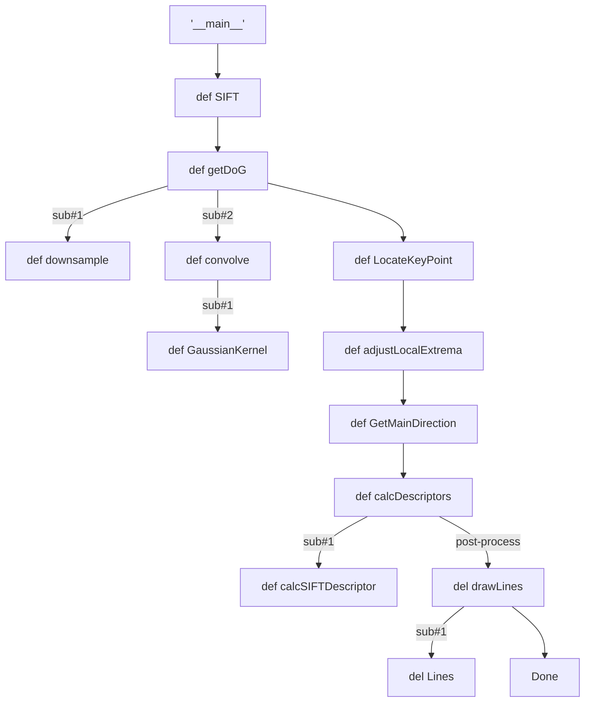

# what it is for

This repository record my learning experience about [SIFT (Scale-Invariant Feature Transform)](https://www.cs.ubc.ca/~lowe/papers/ijcv04.pdf). The first is to read the inital paper fully, you can click the above link. However, that can help me too much understand this algorithm because I cannot connect all parts of algorithm in my mind. So the second step is find some turtorials about SIFT, which really helps us. But the recommendation is in Chinese.

1. [Study Note- SIFT](https://www.bilibili.com/video/BV13v411E7M7/?share_source=copy_web&vd_source=f93bca8d7a0fae6d0060588130d651a2)

2. [6. SIFT Scale-Invariant Feature Transform](https://www.bilibili.com/video/BV1Qb411W7cK/?share_source=copy_web&vd_source=f93bca8d7a0fae6d0060588130d651a2)

PS. the second has the corresponding python code, how to achieve SIFT without opencv-python package. Strongly recommend you to run the code after watching these tutorials. In addtion, you can also find other good tutorials to get it. I will attach the code link [here](https://github.com/o0o0o0o0o0o0o/image-processing-from-scratch/tree/master/sift). 

The core of repository is to **take some notes** in the code I showed you before. I copy the python file from the above link, and try to understand how to achieve it in python practically. I find the inital file lacks **some necessary annotation** for beginners, so this is why I build up this repository. 

# something I find

The inital file is well-organized. and almost everything I can figure out except for the function `def calcSIFTDescriptor(...)`, some parameters and the last two elements of the output `point` in the function `def adjustLocalExtrema(...)`. 

I only use two images to test: the images with notebook. I find if you set `SIFTimage2.jpeg` as `img` and `SIFTimage1.jepg` as `img2`, you will find different results from `SIFTimage1.jepg` as `img` and `SIFTimage2.jepg` as `img2`. I think one of results has accuracy issue. 

# the order

`sub#1` and `sub#2` means sub-branch, the next def is the embedded def. For example,  we need to get DoG (Difference of Gaussian Pyramid) before locating keypoints, `def getDoG` needs other two functions `def downsample` and `def convolve`. Additionally, `def convolve` needs `def GaussianKernel`. If you don't have too much time, you can ignore something after `post-process`, which is about visualization.

Hope my effort can help you get deeper insight into SIFT. Good Luck, your research journey! I think that will help you before using other readily available unility to achieve it. 
